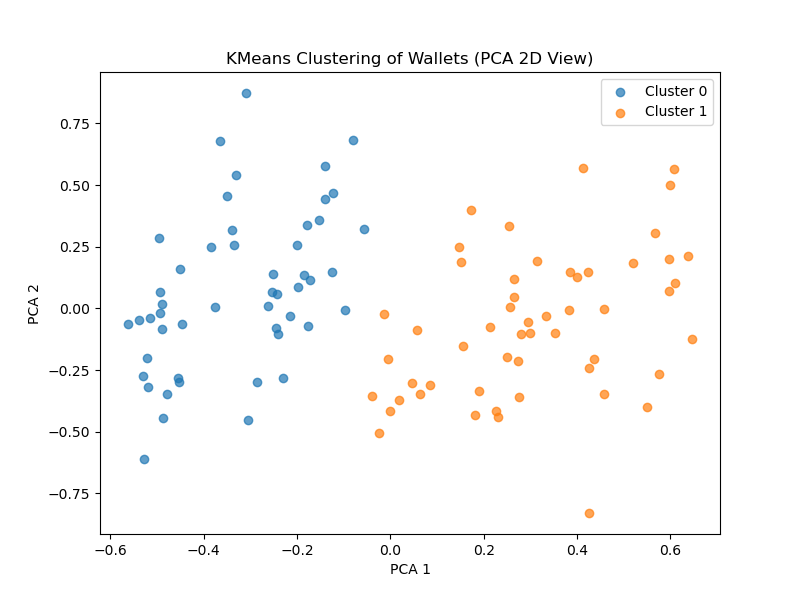

# Zeru Finance – Wallet Risk Scoring (Assignment 2)

This project calculates a **risk score (0–1000)** for Ethereum wallets using their on-chain transaction history.

---

## 🔍 Problem Statement

You are given wallet addresses. The objective is to:
1. Fetch transactions from Etherscan.
2. Create features based on transaction behavior.
3. Apply both rule-based and model-based scoring strategies.

---

## 📦 Data Source

- Transactions fetched using **Etherscan API**
- Feature set includes:
  - Total transactions
  - ETH sent / received
  - Number of failed transactions

---

## 🧠 Rule-Based Risk Scoring

| Rule                                 | Penalty  |
|--------------------------------------|----------|
| tx_count < 5                         | -200     |
| failed_tx > 2                        | -150     |
| total_out > total_in                | -100     |

**Score Formula:**  
```
score = 1000 - penalties
```

---

## 🤖 Model-Based Risk Scoring (KMeans)

**Features Used:**
- tx_count
- total_in
- total_out
- failed_tx

**Steps:**
1. Normalize features
2. Cluster wallets using KMeans (2 clusters)
3. Score based on distance to “safe” cluster centroid

**Visualization:**  
Wallets are projected to 2D using PCA and colored by cluster.



---

## 📁 Input Format

An Excel file with wallet addresses:
```
wallet_id
0xabc...
0x123...
```

---

## 📤 Output Files

- `wallet_risk_scores_combined.csv`: Contains both rule-based and model-based scores
- `kmeans_cluster_visualization.png`: Cluster visualization

---

## 🚀 How to Run

### Install Dependencies
```bash
pip install pandas requests scikit-learn openpyxl matplotlib
```

### Replace your Etherscan API Key
Edit `wallet_risk_scoring_combined.py`:
```python
ETHERSCAN_API_KEY = "YOUR_KEY_HERE"
```

### Run the Script
```bash
python wallet_risk_scoring_combined.py
```

---

## 🧪 Normalization

Normalization was applied only for model-based scoring using MinMaxScaler.  
Rule-based scoring relies on fixed thresholds and does **not** require scaling.

---

## 👨‍💻 Author

Assignment submitted for Zeru Finance – Round 2
