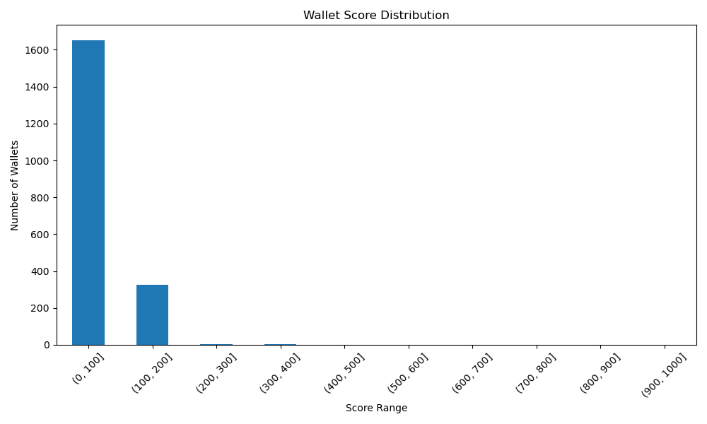

# Analysis of Wallet Credit Scores

## Score Distribution

## High Score Wallet Behaviors
{
  "total_txns": {
    "count": 0.0,
    "mean": NaN,
    "std": NaN,
    "min": NaN,
    "25%": NaN,
    "50%": NaN,
    "75%": NaN,
    "max": NaN
  },
  "deposit_usd": {
    "count": 0.0,
    "mean": NaN,
    "std": NaN,
    "min": NaN,
    "25%": NaN,
    "50%": NaN,
    "75%": NaN,
    "max": NaN
  },
  "borrow_usd": {
    "count": 0.0,
    "mean": NaN,
    "std": NaN,
    "min": NaN,
    "25%": NaN,
    "50%": NaN,
    "75%": NaN,
    "max": NaN
  },
  "repay_usd": {
    "count": 0.0,
    "mean": NaN,
    "std": NaN,
    "min": NaN,
    "25%": NaN,
    "50%": NaN,
    "75%": NaN,
    "max": NaN
  },
  "redeem_usd": {
    "count": 0.0,
    "mean": NaN,
    "std": NaN,
    "min": NaN,
    "25%": NaN,
    "50%": NaN,
    "75%": NaN,
    "max": NaN
  },
  "liquidations": {
    "count": 0.0,
    "mean": NaN,
    "std": NaN,
    "min": NaN,
    "25%": NaN,
    "50%": NaN,
    "75%": NaN,
    "max": NaN
  },
  "active_days": {
    "count": 0.0,
    "mean": NaN,
    "std": NaN,
    "min": NaN,
    "25%": NaN,
    "50%": NaN,
    "75%": NaN,
    "max": NaN
  },
  "repay_borrow_ratio": {
    "count": 0.0,
    "mean": NaN,
    "std": NaN,
    "min": NaN,
    "25%": NaN,
    "50%": NaN,
    "75%": NaN,
    "max": NaN
  },
  "score": {
    "count": 0.0,
    "mean": NaN,
    "std": NaN,
    "min": NaN,
    "25%": NaN,
    "50%": NaN,
    "75%": NaN,
    "max": NaN
  }
}

## Low Score Wallet Behaviors
{
  "total_txns": {
    "count": 3488.0,
    "mean": 24.21817660550459,
    "std": 69.27996048254653,
    "min": 1.0,
    "25%": 1.0,
    "50%": 3.0,
    "75%": 16.0,
    "max": 1227.0
  },
  "deposit_usd": {
    "count": 3488.0,
    "mean": 5.171501331870077e+22,
    "std": 4.6969479041796225e+23,
    "min": 0.0,
    "25%": 1972270723.2422783,
    "50%": 1.8754049652204137e+18,
    "75%": 1.8568039363032423e+21,
    "max": 1.677151133025018e+25
  },
  "borrow_usd": {
    "count": 3488.0,
    "mean": 2.417698003289275e+22,
    "std": 2.6630273271091306e+23,
    "min": 0.0,
    "25%": 0.0,
    "50%": 0.0,
    "75%": 1.5837259273508398e+18,
    "max": 8.52745493084211e+24
  },
  "repay_usd": {
    "count": 3488.0,
    "mean": 1.4740131470410007e+22,
    "std": 1.8672628491857516e+23,
    "min": 0.0,
    "25%": 0.0,
    "50%": 0.0,
    "75%": 2022296412.5346272,
    "max": 5.917608232156698e+24
  },
  "redeem_usd": {
    "count": 3488.0,
    "mean": 3.6356348975224986e+22,
    "std": 4.128445508128849e+23,
    "min": 0.0,
    "25%": 0.0,
    "50%": 0.0,
    "75%": 3.722660576226856e+20,
    "max": 1.8247947388973433e+25
  },
  "liquidations": {
    "count": 3488.0,
    "mean": 0.07110091743119266,
    "std": 0.6937731510440341,
    "min": 0.0,
    "25%": 0.0,
    "50%": 0.0,
    "75%": 0.0,
    "max": 26.0
  },
  "active_days": {
    "count": 3488.0,
    "mean": 21.967316513761467,
    "std": 32.794474632369486,
    "min": 1.0,
    "25%": 1.0,
    "50%": 2.0,
    "75%": 32.0,
    "max": 153.0
  },
  "repay_borrow_ratio": {
    "count": 3488.0,
    "mean": 0.2598522117465852,
    "std": 0.4447672385841544,
    "min": 0.0,
    "25%": 0.0,
    "50%": 0.0,
    "75%": 0.49092558396967856,
    "max": 3.4099990406404777
  },
  "score": {
    "count": 3488.0,
    "mean": 31.201261467889907,
    "std": 41.250779605044535,
    "min": 0.0,
    "25%": 0.0,
    "50%": 6.0,
    "75%": 54.0,
    "max": 193.0
  }
}